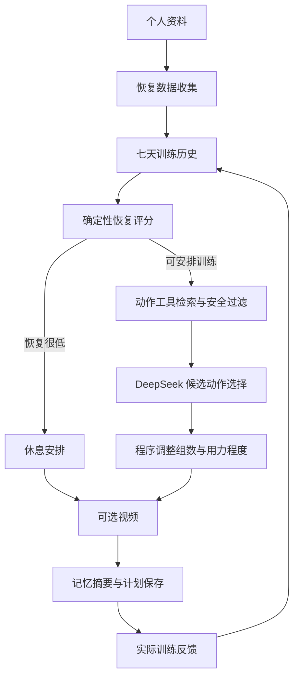

# 自适应健身改造交付记录

更新日期：2026-10-03。当前提供本地可运行的恢复—计划—反馈闭环；外部服务的适配代码与真实连通验收分别记录。

## 分阶段状态

| 阶段 | 已实现 | 验证范围与限制 |
| --- | --- | --- |
| Phase 1 | 恢复、历史模型；确定性评分；负荷统计 | 离线测试通过；公式为初版工程规则，不代表临床效果 |
| Phase 2 | 状态扩展、恢复收集、历史加载、评分、很低恢复条件路由 | 缺失和故障降级、真实 API 返回评分已验证 |
| Phase 3 | 本地动作检索、模型候选选择、计划调整 | 动作不能超出候选集合；伤痛、酸痛、器械和近期高负荷限制；低恢复减少组数与用力程度 |
| Phase 4 | wger REST、MCP Streamable HTTP 客户端、回退链、工具追踪 | JSON/SSE 握手和故障注入通过；未配置实际 MCP 服务，不能声称外部 wger/MCP 已连通 |
| Phase 5 | 视频 Provider、YouTube 搜索、可选视频挂载 | 故障不影响计划；默认模拟 Provider 返回空列表，不伪造视频；未提供 YouTube 密钥，真实视频待验证 |
| Phase 6 | 恢复、训练、反馈 API；MongoDB 保存；分类记忆；重新规划 | 真实数据库闭环通过，重复反馈幂等，酸痛反馈影响下一次动作选择 |
| Phase 7 | 恢复记录、今日训练、训练历史、训练反馈四个中文页面 | 从真实首页导航进入的 AppTest 表单/按钮/结果检查通过；本机前端 HTTP 健康检查通过 |
| Phase 8 | 24 个固定案例、约束检查、检索、故障注入、耗时和模型用量统计 | 仅报告实际运行结果；离线固定案例不代表真实用户训练效果 |

## 如何使用

打开 http://localhost:8501/，按以下顺序使用侧边栏：

1. **个人资料**：保存基础资料，体重为千克，身高为厘米。
2. **恢复记录**：填写睡眠与感受，可在“个人恢复基准与训练限制”中保存个人基线、伤痛和历史完整性。
3. **今日训练**：生成自适应安排，查看恢复评分、调整前后安排与调整原因。该入口不依赖食品嵌入索引。
4. **训练反馈**：填写真实完成的组数、次数、外加重量、用力程度与酸痛。不自动将计划视为已完成。
5. **训练历史**：查看已保存记录与记忆摘要；下一次生成计划会重新读取历史与近 36 小时酸痛反馈。

恢复数据不足时采用保守等级；恢复很低、未知伤痛或没有满足约束的动作时安排休息。当前训练单为“今日”单次计划，不代表提前固定未来一周的恢复状态。外加重量为 0 的自重动作不会虚构身体负重训练量。

## 系统架构与工作流



原有完整计划入口也增加恢复状态输出，保留饮食规划和营养检索模块。新逻辑放在 models、services、agents、tools 下，没有把全部逻辑堆入原 agents.py。

## 接口与数据

新增接口统一位于 `/v1`：

- `POST /recovery/`、`GET /recovery/{user_id}`
- `POST /workouts/session/`、`GET /workouts/history/{user_id}`
- `POST /workouts/today/`、`GET /workouts/today/{user_id}`
- `POST /feedback/`、`GET /memory/{user_id}`

新增 MongoDB 集合：recovery_records、workout_plans、workout_sessions、workout_feedback、user_memory。没有删除既有数据。反馈使用用户与计划标识生成稳定主键；部分写入中断时重试能补齐。记忆摘要失败不撤销已保存的反馈，下次读取会重建摘要。原有个人资料页面提交旧字段时不会清空新加的伤痛和基线字段。

这是沿用原项目用户标识的本地开发应用，尚无账号认证/授权体系，不应直接作为公网多用户服务部署。训练反馈不根据计划虚构实际完成数据。自由训练记录接口当前每次提交新增一条记录，反馈接口则对同一计划进行幂等更新。

## 模型与工具配置

聊天服务已适配 DeepSeek，密钥保存在忽略的 `.env` 中：

```dotenv
CHAT_PROVIDER=deepseek
DEEPSEEK_API_KEY=
CHAT_BASE_URL=https://api.deepseek.com
CHAT_MODEL=deepseek-flash
CHAT_ADVANCED_MODEL=deepseek-v4-pro
EXERCISE_PROVIDER=local
VIDEO_PROVIDER=mock
RECOVERY_PROVIDER=manual
```

本次已真实验证 DeepSeek 鉴权、结构化输出、训练规划及中文总结。模型只选择候选动作，数值调整和最终动作名称由程序控制。模型失败时保留恢复评分并采用筛选后的本地安排。

MCP 配置 `WGER_MCP_URL`、`WGER_MCP_SEARCH_TOOL` 和可选 `WGER_MCP_TOKEN`。当前支持只读搜索，工具参数为 target_muscle/equipment/difficulty/limit，结果使用 results 或 exercises 数组（可放 structuredContent 或 JSON 文本）；不同服务器需按实际工具契约调整适配。客户端支持初始化、工具发现、调用、JSON/SSE 返回和会话释放；不宣称支持所有 wger MCP 实现，也未启用远程例程写入。回退顺序为 MCP → REST → 本地。

wger 返回动作必须命中已校对的本地名称及约束映射后才用于计划；未知动作不会冒充中文化完成或自动获得安全标签。本地数据集目前 10 个动作，属于小型演示清单，检索覆盖面有限。YouTube 搜索偏好中文结果，不满足中文标题检查的结果不显示；视频结果不代表已人工审核动作教学质量。

LangSmith 的关键工作流与工具已添加 traceable，并有 LangGraph 节点追踪。当前没有配置追踪密钥，不宣称已在云端看到链路；启用需要 `LANGCHAIN_TRACING_V2=true` 和 `LANGSMITH_API_KEY`。

## 营养功能的独立缺项

DeepSeek 聊天密钥不用于 OpenAI 嵌入接口。语义食物搜索仍需独立 EMBEDDING_API_KEY、EMBEDDING_BASE_URL、EMBEDDING_MODEL 和相应 FAISS 索引。当前没有这些资源，原“完整计划”页面仍会提示食品检索准备未完成。原饮食 Agent 的 MongoDB 降级逻辑保留，但本轮没有将降级饮食计划宣称为完成真实全流程验收。

更换嵌入模型后必须重新生成索引，不可混用不同向量空间。现有阈值公式针对原单位归一化 OpenAI 向量；其他服务需要另行验证归一化与距离。

## 启动、测试和评估

本轮最终验收：72 项单元/API/协议/故障注入测试通过；原有 7 项运行修复回归测试通过；既有中文页面与四个新页面的 AppTest 均通过。真实 MongoDB + DeepSeek 闭环通过，测试记录已按虚构用户标识清理。

24 个固定案例分类与计划约束一致率均为 100%；仅针对三个指定本地腿部动作的 Recall@10 为 100%。本次离线流程平均耗时约 0.38 毫秒，不包含模型网络时间。三次故障注入均成功回退；其九次工具尝试中六次故意失败、三次成功。独立的一次真实模型调用结构有效，服务返回总用量 788 tokens。这些小样本数字不是生产质量或医学效果证明。

在项目根目录执行：

```powershell
.\.venv\Scripts\python.exe -m uvicorn fast_api.app.main:app --host 127.0.0.1 --port 8000
.\.venv\Scripts\python.exe -m streamlit run streamlit/streamlit/🏠_home.py --server.port 8501
.\.venv\Scripts\python.exe -m unittest discover -s tests -v
.\.venv\Scripts\python.exe scripts/test_runtime_repairs.py
.\.venv\Scripts\python.exe scripts/check_chinese_ui.py
.\.venv\Scripts\python.exe scripts/check_adaptive_ui.py
.\.venv\Scripts\python.exe scripts/benchmark_adaptive.py
# 下列脚本会少量调用真实模型，并清理自己创建的虚构用户。
.\.venv\Scripts\python.exe scripts/verify_adaptive_live.py
docker compose config --quiet
docker compose up -d mongodb_ai_fitness_planner ai_fitness_planner_db mongo_express_ai_fitness_planner
```

实测环境采用 Python 虚拟环境运行前后端、Docker 运行数据库。Compose 配置验证通过，三个数据库相关容器正在运行。整套前后端 Docker 镜像本轮未重新构建；原 Dockerfile 使用旧 buster 基础镜像，完整容器化仍需单独验收。

评估输出：`docs/adaptive_benchmark.json`；真实闭环样例：`docs/adaptive_live_verification.json`。固定规则案例的分类一致率和约束通过率只代表测试集；本地检索 Recall@10 仅针对列出的三个腿部动作。工具成功率包含故意注入的远端失败，不能解释为远端服务可用率。单次真实模型的格式通过率和 token 用量不代表规模化平均表现。

浏览器自动化工具因 Windows sandbox helper 错误无法运行，因此未生成伪称来自运行界面的截图。页面验证使用 Streamlit AppTest（实际入口和导航）及运行服务健康检查。

## 文件变化概要

- 新增模型、Provider、存储、记忆、今日工作流、动作规划与调整、工具适配、adaptive API。
- 新增四个中文页面及 adaptive_ui 公共展示模块。
- 新增阶段单元/API/故障注入/协议测试、固定案例和真实闭环检查脚本。
- 修改模型配置入口、原 LangGraph 状态/节点、个人资料向后兼容更新、FastAPI 路由、首页导航、环境变量示例、README 与记录文档。
- 本轮未增加或升级 Python 依赖，未修改数据库容器架构。

## 接口参考

- [DeepSeek 官方兼容接口说明](https://api-docs.deepseek.com/zh-cn/)
- [wger 官方 API 文档](https://wger.readthedocs.io/en/latest/api/api.html)
- [MCP Streamable HTTP 规范](https://modelcontextprotocol.io/specification/2025-03-26/basic/transports)
- [YouTube 搜索接口文档](https://developers.google.com/youtube/v3/docs/search/list)
